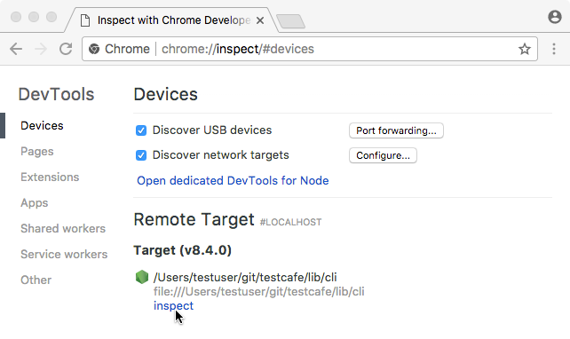

# TestCafe E2E Test for craigslist.org
## About the Application
- Craigslist (stylized as craigslist) is a classified advertisements website with sections devoted to jobs, housing, for sale, items wanted, services, community service, gigs, résumés, and discussion forums.

## About the Framework
- E2E tests Framework written in [Testcafe](https://github.com/DevExpress/testcafe).
- Design Pattern: Page Model [PageModel](https://testcafe.io/documentation/402826/guides/concepts/page-model)
- Language: Javascript

## Automation Scope
 - Test the Madrid city Housing a.k.a https://madrid.craigslist.org/

## Automated Functionality 
* Sorting (price ⬆, price ⬇)
    * Verified the house is ascending / descending order based on price 
    * Test expect atleast one house to present
* By default, such sorting possibilities are available (price ⬆, price ⬇, newest)
    * Verified the default sorting options are present
* After using search such sorting possibilities are available (price ⬆, price ⬇, newest,
upcoming, relevant)
    * Verified the sorting options changed after the search

# Setup and Execution
1. Pre-requisite
   ```
   node version 6.14.8 and above
   ```
2. Environment Setup
    ```
    $ git clone https://github.com/tmrprakash/craiglist-ui.
    $ cd craiglist-ui
    $ npm install
    ```
   
3. Execute Test
    
    ```
        Browser   | CLI
        --------- | ----------------------
        Chrome    | $ npm run test:chrome
        Firefox   | $ npm run test:firefox
    ```
4. Reports
    - Test Reports are available in
    ```
    ./cucumber-json-reports/html/index.html
    ```
    - 

# Debugging

### Client Side Debugging
- All test execuction CLI takes screenshot on failures
- Based on the Error logger and screenshot, easilt identify the failure reason
- 
- 
- Introduce debug() function call before the failure 
    ```
        async navigateToHousing() {
        await t
            .debug()
            .click(this.housingLink);
    }
    ```
- While test exectution , it stops on the debugger statement. Browser has the option to Resume / Next Action
- 

### Server Side Debugging
- Start debug server
    ```
    $ npm run test:serverdebug
    ```
- Put the debugger keyword in test code where you want to stop.
    ```
        async navigateToHousing() {
            debugger;
        await t
            .click(this.housingLink);
    }
    ```
- Navigate to chrome://inspect in Google Chrome. In the Remote Target section, find the Node.js debugger and click Inspect.

- 

- Chrome will invoke its Developer Tools and the debugger will stop test execution at the first line. Click the Resume script execution button or press F5 to continue. After that, text execution will pause at the debugger keyword allowing you to debug test code.